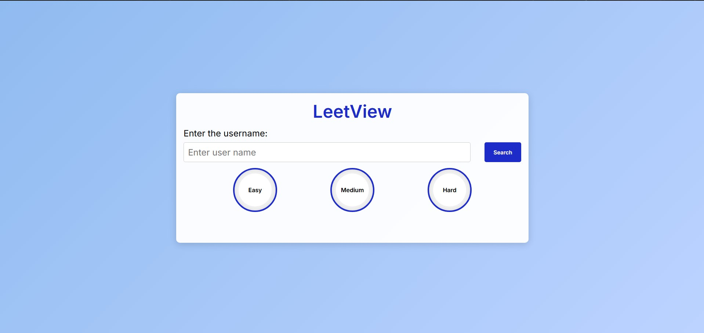
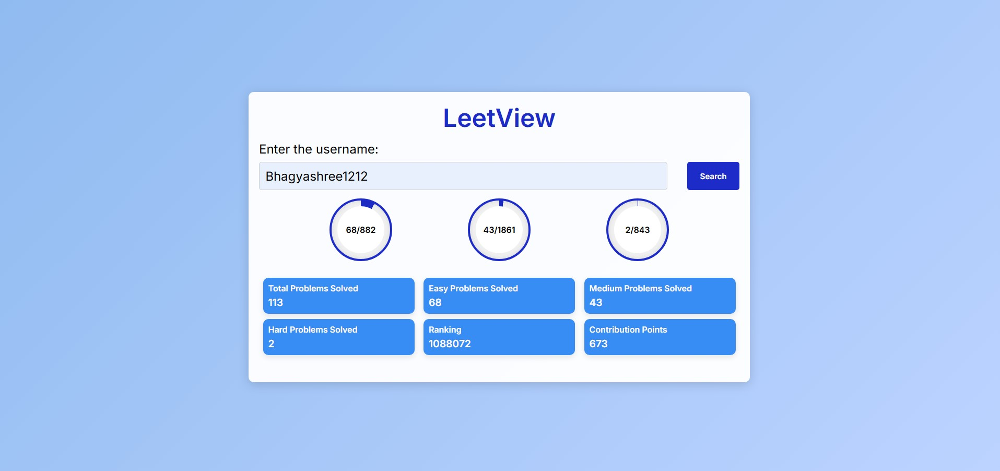

# 🚀 LeetView

LeetView is a simple web application that fetches and displays **LeetCode user statistics** including problems solved by difficulty (Easy, Medium, Hard),ranking, and contribution points. It uses the [LeetCode Stats API](https://leetcode-stats-api.herokuapp.com/) and represents progress in a professional, visually intuitive layout using HTML, CSS, and JavaScript.

---

## 🌐 Live Demo

🔗 [Click here to visit LeetView Live](https://bhag1212.github.io/LeetView/)

---

## 📸 Screenshots

### 🔍 Home Page (Before Search)

### 📊 After Search (User Statistics)

---

## Features
This web application includes following features
- 🔎 Search for any LeetCode username
- 📈 Displays:
  - Problems solved categorised in the form of Easy/Medium/Hard
  - LeetCode ranking
  - Contribution points
- 🟢 Circular progress bars for difficulty-wise breakdown

---

## 🛠️ Tech Stack

- **Frontend**: HTML, CSS, JavaScript
- **API**: [LeetCode Stats API](https://leetcode-stats-api.herokuapp.com/)
- **Hosting**: GitHub Pages

---

### ✅ Run Locally

1. Download or clone this repository.
2. Make sure all files (`index.html`, `style.css`, `script.js`) are in the same directory.
3. Open `index.html` in your browser.
4. Enter a LeetCode username and click **Search**.

